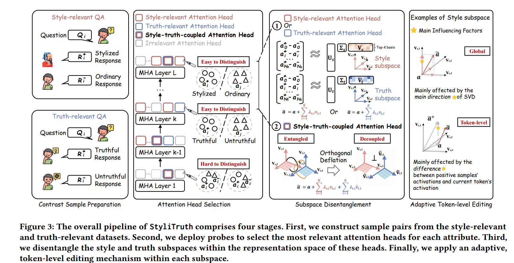

[](https://huggingface.co/datasets/starrylay/StyliTruth-TruthfulQA-ZN)
# StyliTruth



Repository for paper “Balancing Stylization and Truth via Disentangled Representation Steering”.

**[Update 26/2/2] 🔥 Our work has been accepted to ICLR'26!**

**Paper Link** 🔗: [https://openreview.net/forum?id=mNVR9jJYqK](https://openreview.net/pdf?id=GECUTH82ze) (ICLR'25)


## Table of Contents
1. [Installation](#installation)
2. [Workflow](#workflow)


## Installation
Run the following commands to set things up.
```
git clone XXXX (This Github Link)
cd StyliTruth
conda env create -f environment.yml
conda activate StyliTruth
```

## Workflow

(1) [For ALL] Set your own model path in `stepx_xxxxx.py`

(2) [For EVAL] Set your own openai api key in `step5_gpt4o_rating.py`

(3) [For EVAL] Run `scripts/train_class.sh` to obtain the trained style classfiers.

(3) [For ALL] Run `scripts/run_all_en.sh` or `scripts/run_all_zn.sh` to launch all workflows sequentially and obtain the results.


---

**Finally, if you find our work helpful or interesting, please don't forget to cite us!**

ICLR Version
```
@inproceedings{shen2025stylitruth,
  title={StyliTruth: Unlocking Stylized yet Truthful LLM Generation via Disentangled Steering},
  author={Shen, Chenglei and Sun, Zhongxiang and Shi, Teng and Zhang, Xiao and Xu, Jun},
  booktitle={The Fourteenth International Conference on Learning Representations},
  year={2025}
}

```
